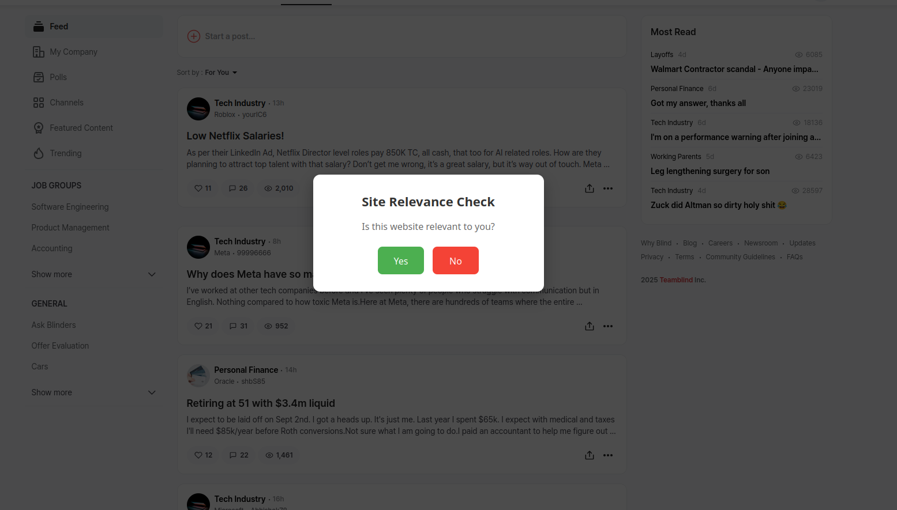
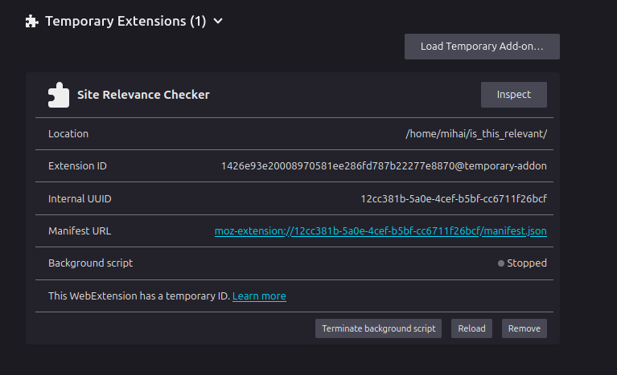
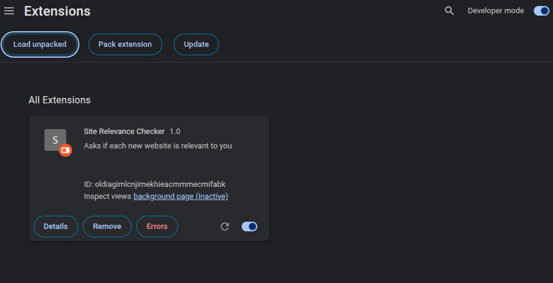

# Is this relevant ?

Browser extension that creates a pop-up dialog everytime you open a new webpage. The dialog ask a simple question: "Is this relevant to you ? ". This gives you a moment of reflection to asses if you are on a road to procastination or doing something useful. If you press "Yes" the dialog will dissapear,  if you press "No" the tab will be closed.

## Local instalation 
At the moment the extension can only be run locally thus it needs to be added everytime you open the browser.

### Firefox 
In order to the load the extension on Firefox follow the next steps:
- Type `about:debuging` in the search bar
- Select `This Firefox` 
- Choose `Load Temporary Add-on`. 
- Select the `manifest.json` file and everything should work.

### Chrome  

In order to the load the extension on Chrome follow the next steps:
- Type `chrome:extensions` in the search bar
- Turn on `Developer mode`
- Select `Load unpacked` and use this folder.

